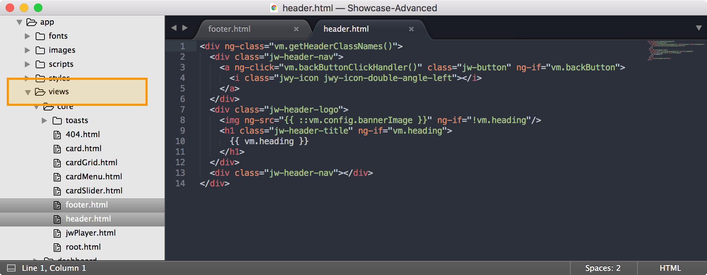
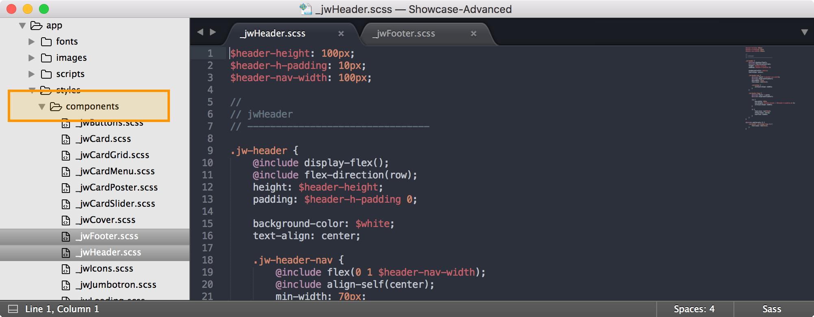
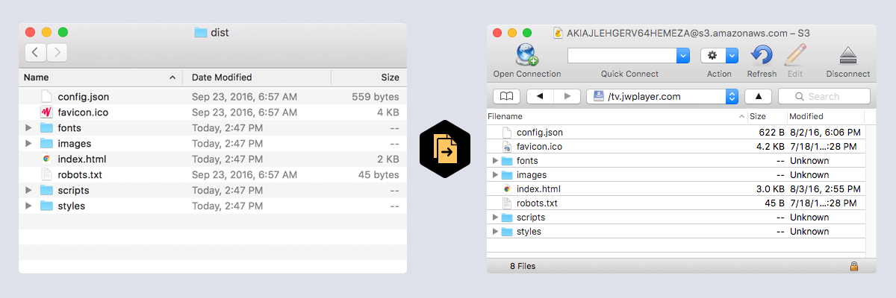

# Getting Started with JW Showcase for Web

<sup>Last Updated: April 15, 2019</sup>

!!!warning
JW Player has deprecated support for JW Showcase for Apple TV.
!!!

JW Showcase is a video gallery web app that leverages playlists from your JW Player dashboard to distribute your content on desktop and mobile web. Use the steps below to set up a self-hosted Showcase.

You can also set up a [cloud-hosted version of JW Showcase](https://support.jwplayer.com/articles/set-up-a-jw-showcase). With the cloud-hosted version, you can configure and customize your Showcase within your JW Player dashboard.

!!!tip
If you have additional questions after reading this article, read the <a href="https://github.com/jwplayer/jw-showcase/wiki" target="_blank">JW Showcase wiki</a>.
!!!

<br/>

## Get Showcase code

JW Player offers two versions of the Showcase code: source code and precompiled code.

| Type | Notes and code location |
| -- | -- |
| Precompiled code | - Allows basic configuration and customization<br/>- Provides a simpler self-hosted Showcase implementation<br/><br/>From the <a href="https://github.com/jwplayer/jw-showcase/releases/" target="_blank">JW Showcase GitHub repository</a>, click **precompiled-static-app.zip** for the latest release.|
| Source code | - Permits advanced configuration and customization<br/>- Allows greater control over the Showcase framework<br/>- Provides the ability to keep your Showcase in sync with the source repository<br/><br/>`git clone https://github.com/jwplayer/jw-showcase.git`|

<br/>

## Acquire player and playlist IDs
Before you can configure your Showcase, you need to locate and copy the IDs of the player and playlists that you want to associate with your Showcase.

### Player ID
1. From your <a href="https://dashboard.jwplayer.com/" target="_blank">dashboard</a>, click **Players**.
2. Click the name of the player.
3. In the **Cloud-Hosted Player Library** section in the right panel, copy the eight-digit value at the end of the URL. <br/><br/>For example, if the URL is <code>https://cdn.jwplayer.com/libraries/VeAzOR4Y.js</code>, copy <code>VeAzOR4Y</code>.

### Playlist IDs
1. From your <a href="https://dashboard.jwplayer.com/" target="_blank">dashboard</a>, click **Playlists**.
2. Click the name of the playlist. You can add any manual, dynamic, or trending playlist to your Showcase.
3. On the **DEVELOPERS** tab, copy the **Playlist ID**.
4. Repeat these steps to locate and copy the IDs of each playlist you want to include in your Showcase.

<br/>

## Configure Your App

1. In a text editor, open **app/config.json** (compiled) or **config.json** (precompiled) from the JW Showcase folder.
2. Replace the value for `player` with the eight-digit player ID that you copied from your dashboard.
3. Replace the value for `featuredPlaylist` with the ID for the playlist that you want to feature in your Showcase.
4. Replace the values for `playlists` with the IDs for the additional playlists that you want to appear in your Showcase. These playlists will appear in your Showcase in the order in which they are listed. 
5. (Optional) Use the following code example and table to customize other properties to match your brand. 

!!!tip
If you are using the Showcase source code, you can add [advanced customizations](#advanced-customization) to your Showcase.
!!!


```json
{
  "player": "DTYxzkKG",
  "theme": "light",
  "siteName": "JW Showcase",
  "description": "JW Showcase is an open-source, dynamically generated video website built around JW Player and JW Platform services. It enables you to easily publish your JW Player-hosted video content with no coding and minimal configuration.",
  "bannerImage": "images/logo.png",
  "footerText": "Powered by JW Player",
  "backgroundColor": "",
  "featuredPlaylist": "lrYLc95e",
  "playlists": [
    "WXu7kuaW",
    "Q352cyuc",
    "oR7ahO0J"
  ]
}
```
| Property | Type | Description |
| -- | -- | -- |
| `backgroundColor`| String | Color of the Showcase background<br/><br/>**NOTE**: If you are using the source code, advanced customizations should be made in the [.scss files](#advanced-customization).
| `bannerImage`| String | URL of your brand logo<br/><br/>The ideal logo height is 72px. For logos that have a height that is greater than 72px, the logo will be proportionally resized.
| `description` | String | Short explanation of the Showcase content|
| `featuredPlaylist`| String | Unique identifier of the playlist that you want to feature in your Showcase |
| `footerText` | String | Text that appears in the footer |
| `player` | String | Unique identifier of the player used in your Showcase|
| `playlists` | Array | List of the identifiers of additional playlists that you want to appear in your Showcase|
| `siteName` | String | Name of the `<title>`, `<og:title>`, and `<og:site_name>` properties of your Showcase|
| `theme` | String | Preconfigured theme of the Showcase<br/><br/>Possible values include:<br/><br/>`dark`<br/><br/>`light`|

<br/>

<a name="advanced-customization"></a>

## Advanced Customization

If you are using the source code to create your Showcase, you have the ability to add advanced customizations to your Showcase. This section briefly explains where you can set custom HTML and custom CSS. 

!!!
If you are using the precompile code to create your Showcase, continue to [Install tools and compile app](#install-and-compile).
!!!

### Custom HTML

Showcase is built from “views” located within the **app/views** folder of your project. Here you can modify the default HTML of your Showcase. The **header.html** and **footer.html** files are shown in the following screenshot. 



### Custom CSS

Showcase uses Sass to compile a master .css file from partial .scss files located within the **app/styles/components** folder of your project. Custom CSS can be added to the .scss files. The  **header.scss** and **footer.scss** files are shown in the following screenshot.



<br/>

<a name="install-and-compile"></a>

## Install tools and compile app

Once your Showcase has been configured and customized, you must install several tools, compile your Showcase, and upload your Showcase to your web server.

1. Install the following tools globally on your machine:<br/><br/>`$ gem install compass`<br/>`$ npm i grunt-cli -g`<br><br/> 
2. Install project dependencies for Node.<br><br/>`cd /path/to/showcase-source-code/`<br/>`$ npm install`<br/><br/>
3. Compile your Showcase.<br/><br/>`grunt build`<br/><br/>
4. Preview and test your Showcase locally.<br/><br/>`grunt serve`<br/><br/>
5. After previewing and testing your Showcase, upload the files in the **dist** folder to your own web server.



<br/><br/>
<div id="wufoo-mff60sc1xnn4cu">
Use this <a href="https://jwplayerdocs.wufoo.com/forms/mff60sc1xnn4cu">form</a> to provide your feedback.
</div>
<script type="text/javascript">var mff60sc1xnn4cu;(function(d, t) {
var s = d.createElement(t), options = {
'userName':'jwplayerdocs',
'formHash':'mff60sc1xnn4cu',
'autoResize':true,
'height':'288',
'async':true,
'host':'wufoo.com',
'header':'show',
'ssl':true,
'defaultValues': 'field118=' + location.pathname};
s.src = ('https:' == d.location.protocol ? 'https://' : 'http://') + 'www.wufoo.com/scripts/embed/form.js';
s.onload = s.onreadystatechange = function() {
var rs = this.readyState; if (rs) if (rs != 'complete') if (rs != 'loaded') return;
try { mff60sc1xnn4cu = new WufooForm();mff60sc1xnn4cu.initialize(options);mff60sc1xnn4cu.display(); } catch (e) {}};
var scr = d.getElementsByTagName(t)[0], par = scr.parentNode; par.insertBefore(s, scr);
})(document, 'script');</script>
